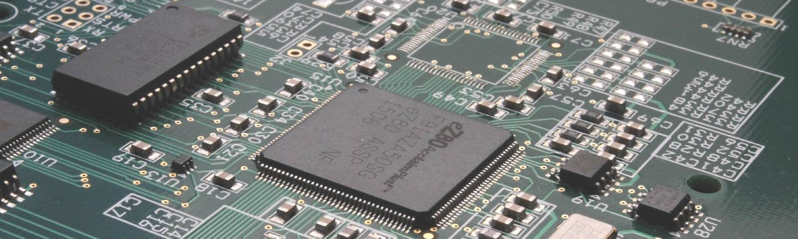

    
    <!-- Image Credit: https://www.previousmagazine.com/wp-content/uploads/2020/08/Circuit-board.jpg -->

 
    Computer & Electronics Engineer | IT Support | Problem Solver | Automotive Technical Trainer | Family Man | AI Graduate Student at Florida Atlantic University. 

    &nbsp;&nbsp;
    &nbsp;&nbsp;
    

    Connect With Me:    

    

