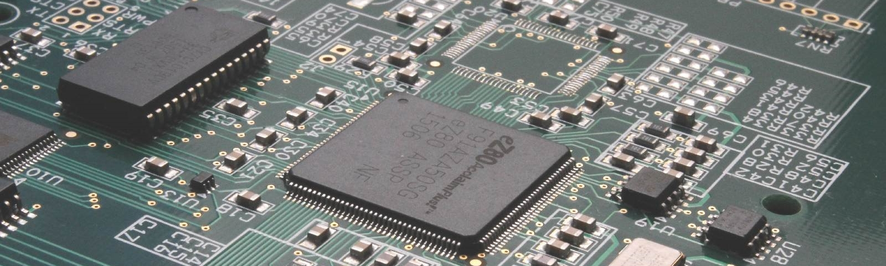

# Hi, I'm Joel 👋

**Computer Hardware Engineer | Strategic Troubleshooter | Master Technician Trainer**

&nbsp;&nbsp;

 

## 💼 What I Do  

- 🚘 **Automotive Repair and Restoration** - Currently fixing & maintaining Ferraris @ [Ferrari Palm Beach](https://palmbeach.ferraridealers.com/en-US/cars)  
- 🌐 **Web Development** - Current Director of Web Development for [MICC](https://github.com/Mary-Immaculate-WPB)  
- 📡 **Ham Radio** - RF tooling and legacy radio programming systems for personal enjoyment  

## 🧰 Other Expertise  

**Production & Test Engineer** with experience in:  
- 🤖 **SMT Manufacturing** - Pick-and-place, reflow, AOI, X-ray inspection, machine setup and machine repairs  
- 💻 **Hardware Testing** - Functional testing, QA, RMA repairs and component-level troubleshooting for embedded computer systems  
- 📋 **Process Optimization** - Cross-functional collaboration for maximum efficiency  
- 🏛️ **Technical Leadership** - Mentoring teams to solve complex problems  

## 📊 GitHub Stats  

&nbsp;&nbsp;

## 💡 Skills & Technologies  

**Languages:** C, C++, Python, JavaScript, HTML/CSS, Bash, Assembly  
**Tools:** Git, VS Code, Altium Designer, WINE, Docker  
**Hardware:** SMT production equipment, RF test equipment, oscilloscopes, multimeters  
**Platforms:** Linux (Mint, Ubuntu), FreeDOS, Windows  

## 🚀 Featured Projects  

### [SDR Phased Array Beamforming](https://github.com/ADolbyB/sdr-beamforming)  
- Multi-channel phase-coherent SDR systems  
- Digital beamforming algorithms and implementation  
- Direction of Arrival (DoA) estimation  

### [Latex Publications and Templates](https://github.com/ADolbyB/latex-publications-templates)  
- Professional document structure and formatting  
- Clean formatting that meets academic standards  
- IEEE conference paper formatting  

### [Mary Immaculate Catholic Church Website](https://github.com/Mary-Immaculate-WPB)  
- Recovered and rebuilt deleted website from Wayback Machine archives  
- Deployed with custom domain and email infrastructure  
- Donated perpetually to serve the faith community  

### [Ham Radio RF Toolbox](https://github.com/ADolbyB/ham-radio-rf-toolbox)  
- Modern solution for programming legacy Part 90 commercial radios  
- Dual-boot FreeDOS/Linux system for abandonware compatibility  
- Automated installation and deployment scripts  

## 📫 Let's Connect  

  

**73 de ADolbyB** 📡  

---

*Building solutions, solving problems, serving communities*  

